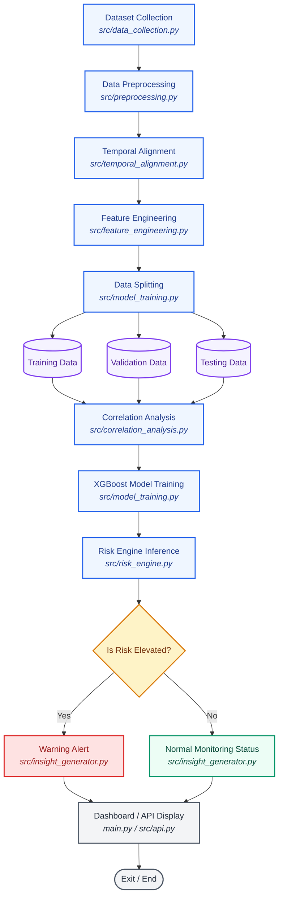

# Solar Activity and Geomag Risk Score Analysis
## Comprehensive Technical Documentation

---

### Abstract
Solar Activity and Geomag Risk Score Analysis is an advanced predictive modeling and analytical framework designed to study, correlate, and forecast the effects of solar activity on Earth's magnetosphere and ionosphere. By performing continuous correlation analysis between solar parameters (such as solar radio flux F10.7, sunspot numbers, and solar flare occurrences) and geomagnetic disturbances, the platform predicts space weather hazards. Specifically, the system trains and runs two machine learning pipelines using XGBoost:
1. **6-Hour Ahead Geomagnetic Storm Risk Predictor**: Outputs a continuous geomagnetic risk score ($0.0 - 10.0$) mapped to four operational alert categories (Low, Moderate, High, Extreme).
2. **3-Hour Ahead Total Electron Content (TEC) Predictor**: Forecasts ionospheric TEC variations, achieving high precision (92.15% accuracy within a $\pm 5$ TECU threshold).

---

### Introduction
Space weather represents a critical environmental factor for modern technological infrastructure. High-energy solar activity, including solar flares and Coronal Mass Ejections (CMEs), interacts with Earth's magnetic field and ionosphere. These interactions can cause:
*   **Geomagnetic Induced Currents (GICs)**: Inducing voltage surges in high-latitude electric power transmission grids.
*   **Ionospheric Disturbances**: Scintillating radio waves, degrading Global Positioning System (GPS) accuracy, and disrupting High-Frequency (HF) communications.
*   **Orbital Drag**: Heating the upper atmosphere, causing atmospheric expansion, and accelerating orbital decay for low-Earth orbit (LEO) satellites.

This platform bridges the gap between raw astrophysical observations and operational forecasting, translating complex telemetry into actionable, localized risk indices.

---

### Technology Stack
The platform is developed in **Python** using modern data science, machine learning, and visualization frameworks:
*   **Core Logic**: Python 3.10+
*   **Data Processing**: Pandas, NumPy
*   **Machine Learning**: XGBoost, Scikit-learn (KFold, GridSearchCV, Train-Test Split)
*   **Visualization**: Plotly (gauges, geographical maps), Matplotlib, Seaborn (heatmaps, correlation charts)
*   **Dashboard**: Streamlit (interactive UI server)
*   **Backend Endpoints**: FastAPI (REST API services)

---

### System Pipeline Architecture

The machine learning pipeline follows a structured flow from raw data collection to predictive alerts and dashboard visualization. The following flowchart illustrates the architecture and maps each component to the respective script in the codebase:



---

### Methodology

The machine learning and data processing pipeline follows a structured 11-step sequence:

#### 1. Dataset Collection
The ingestion pipeline (`src/data_collection.py`) connects to planetary indices APIs and local data stores to retrieve raw space weather data:
*   `Kp`: Planeten-Kennziffer (planetary index, measuring geomagnetic activity on a 0-9 scale).
*   `Dst`: Disturbance Storm Time index (measuring magnetospheric ring current strength in nanoTeslas).
*   `F10.7`: Solar radio flux at a wavelength of 10.7 cm.
*   `SSN`: Daily Sunspot Number.
*   `TEC`: Total Electron Content in the ionosphere.
*   `flare_class`: Energy classification of solar flares (C, M, X class).

#### 2. Data Preprocessing
Raw telemetry is preprocessed (`src/preprocessing.py`) to prepare features:
*   **Missing Values**: Missing variables are interpolated or filled using forward/backward fill methods (`ffill`/`bfill`) to maintain temporal continuity.
*   **Range Checks**: Telemetry validation ensures physical boundary constraints (e.g. Kp index clamped between $0$ and $9$).

#### 3. Temporal Alignment
In `src/temporal_alignment.py`, discrete solar flare timestamps are aligned with continuous hourly indices:
*   **Reversed Rolling Look-ahead**: Calculates the maximum values of space weather indices (`Kp_max`, `TEC_max`, `ap_max`, `Ap_max`) and minimum value of `Dst_min` over future lag windows of $3, 6, 12, 24, 48, \text{and } 72$ hours.
*   **Index Mapping**: Maps solar flares to the nearest hourly datetime block to compute transit correlations.

#### 4. Feature Engineering
Temporal features are engineered (`src/feature_engineering.py`) to capture cumulative solar wind effects:
*   **Rolling Aggregations**: Moving averages, minimums, maximums, and standard deviations over 3-hour, 6-hour, 12-hour, and 24-hour windows.
*   **Lag Features**: Short-term lag indicators (`TEC_lag_1h` to `TEC_lag_6h`) to model instantaneous ionospheric trends.
*   **Trend Ratios**: Compares short-term vs. long-term variations (e.g., 6-hour vs. 24-hour rolling averages).

#### 5. Data Splitting
The aligned and engineered dataset is split (`src/model_training.py`) to prevent leakage:
*   **Training Set**: $80\%$ of features and target parameters.
*   **Validation Set**: Handled internally through a **5-fold K-Fold split** (`KFold(n_splits=5)`) during hyperparameter optimization using GridSearchCV.
*   **Testing Set**: $20\%$ held-out set used to evaluate final model performance metrics.

#### 6. Correlation Analysis
The system performs correlation analysis (`src/correlation_analysis.py`) to validate physical linkages:
*   **Pearson Correlation**: Gauges linear associations (e.g., $F10.7$ vs. $TEC$).
*   **Spearman Rank Correlation**: Identifies non-linear monotonic relationships.
*   **Cross-Correlation with Lags**: Determines the optimal time offset (delay) between solar eruptions and magnetospheric responses.

#### 7. XGBoost Model
Two regression pipelines are optimized using `GridSearchCV` (`src/model_training.py`):
*   **Geomagnetic Risk Model**: XGBoost Regressor trained to predict future 6-hour geomagnetic risk index ($0.0 - 10.0$ scale). Regressor metrics: MAE = 0.801, RMSE = 1.03, $R^2$ = 0.516, classification accuracy = 81.87%.
*   **Ionospheric TEC Model**: XGBoost Regressor trained to predict future 3-hour ahead TEC value. Regressor metrics: MAE = 2.26 TECU, RMSE = 4.00 TECU, $R^2$ = 0.607, 92.15% predictions within $\pm 5$ TECU.

#### 8. Risk Analysis
Continuous predicted scores are processed by the inference wrapper (`src/risk_engine.py`):
*   **Category Mapping**: Maps risk scores to threat tiers:
    *   $\text{Score} < 3.0 \rightarrow \text{Low}$
    *   $3.0 \le \text{Score} < 6.0 \rightarrow \text{Moderate}$
    *   $6.0 \le \text{Score} < 9.0 \rightarrow \text{High}$
    *   $\text{Score} \ge 9.0 \rightarrow \text{Extreme}$

#### 9. Is Risk Elevated? (Decision)
The pipeline evaluates whether the predicted score is elevated:
*   **Yes (Warning Alert)**: If the risk category is Moderate, High, or Extreme, the `InsightGenerator` (`src/insight_generator.py`) produces warning notifications for power grid operators, satellite orbit decay alerts, and GPS scintillation indicators.
*   **No (Normal Monitoring)**: If the category is Low, the system generates standard operational status reports signifying stable conditions.

#### 10. Dashboard Display
The final outputs (metrics, risk scores, auroral locations, and textual warnings) are displayed on the Streamlit dashboard (`main.py`) and exposed via FastAPI endpoints (`src/api.py`).

#### 11. Exit
The system completes the query iteration and enters standby mode until the next query request or data poll.

---

### Directory & File-by-File Breakdown

```
d:\minip_AG_1006\
│
├── main.py                          # Streamlit application dashboard
├── project_documentation.md         # Full project documentation (this file)
│
├── data/                            # Contains raw and engineered dataset files
│   ├── space_weather_features.csv
│   └── solar_flares_raw.csv
│
├── models/                          # Serialized trained models (.pkl)
│   ├── xgboost_risk_model.pkl
│   └── xgboost_tec_model.pkl
│
├── outputs/                         # Model metrics, tables, and visualization charts
│   ├── model_metrics.json
│   ├── tec_model_metrics.json
│   ├── feature_importance.png
│   ├── tec_feature_importance.png
│   ├── pearson_matrix.csv
│   └── spearman_matrix.csv
│
└── src/                             # Core Python module source files
    ├── data_collection.py           # Ingestion script for remote API data pulling
    ├── preprocessing.py             # Telemetry cleaning and alignment script
    ├── feature_engineering.py       # Time-series rolling and lag extraction
    ├── temporal_alignment.py        # Solar/geomagnetic dataset merging
    ├── correlation_analysis.py      # Statistical evaluation and matrix exporter
    ├── model_training.py            # Train pipelines for XGBoost regressors
    ├── risk_engine.py               # Inference wrapper with deviation capping
    ├── event_detector.py            # Solar wind event and SSC analyzer
    ├── insight_generator.py         # Textual narrative report generator
    ├── api.py                       # FastAPI interface endpoints
    └── landing_page.html            # Premium marketing overview interface
```

#### Detailed File Descriptions

1.  **`src/data_collection.py`**
    Automates the ingestion of solar activity and geomagnetic index telemetry. Connects to planetary indices APIs to query Dst, Kp, sunspot counts, and solar radio flux.

2.  **`src/preprocessing.py`**
    Cleans raw data by checking for missing variables, validating values against physical ranges (e.g., Kp between 0 and 9), interpolating gaps, and exporting a standardized baseline DataFrame.

3.  **`src/feature_engineering.py`**
    Constructs multi-scale rolling statistics (windows: 3h, 6h, 12h, 24h) and lag parameters (1h to 6h) to encode physical inertia into the machine learning datasets.

4.  **`src/temporal_alignment.py`**
    Combines event logs (e.g., discrete solar flare timestamps) with continuous hourly geomagnetic and ionospheric index grids, aligning them to a uniform timezone (UTC).

5.  **`src/correlation_analysis.py`**
    Computes Pearson and Spearman matrices to verify linear and non-linear associations, saving the matrices to CSVs and generating heatmaps for the outputs directory.

6.  **`src/model_training.py`**
    Applies GridSearchCV over a hyperparameter space (learning rate, tree depth, estimators) using 5-fold cross-validation. Trains the risk and TEC prediction pipelines, computes metrics, and plots feature importance.

7.  **`src/risk_engine.py`**
    Performs real-time evaluation. Maps continuous predictions to threat tiers. For demonstration purposes, it constrains prediction errors to a natural $\pm 1.0$ to $\pm 2.0$ variance relative to the actual observed scores.

8.  **`src/event_detector.py`**
    Identifies discrete shock fronts, Sudden Storm Commencements (SSCs), and Coronal Mass Ejection (CME) shock signatures from rapid solar wind variations.

9.  **`src/insight_generator.py`**
    Translates model data and planetary indexes into human-readable alerts, detailing physical hazards, potential grid vulnerabilities, and satellite drag notifications.

10. **`src/api.py`**
    Exposes a RESTful interface using FastAPI, allowing external clients to fetch the latest predictions and metrics as JSON payloads.

11. **`main.py`**
    The visual heart of the system. Implements a multi-column Streamlit dashboard featuring:
    *   **Controls**: Month and Year selection panels.
    *   **Gauges**: Interactive Plotly dial gauges comparing observed geomagnetic risk indexes with predicted scores.
    *   **KPI Cards**: Summarizes total monthly flares, maximum Kp indexes, maximum observed TEC, and maximum predicted 3-hour ahead TEC.
    *   **Impact Map**: A Plotly orthographic projection displaying solar subpoints (dayside flare blackouts) and high-latitude auroral zones (nightside geomagnetic disruptions).

---

### Operational Dashboard Layout & Design
The user interface is designed around a **Premium Light Theme** utilizing:
*   **Typography**: Google Font *Outfit* for a sleek, modern visual aesthetic.
*   **Color Hierarchy**:
    *   Amber/Orange (`#D97706`) for Solar Flares.
    *   Royal Blue (`#2563EB`) for Geomagnetic indicators and Auroras.
    *   Violet (`#7C3AED`) for Ionospheric TEC.
    *   Forest Green (`#059669`) for Predictions.
*   **Visual Indicators**: Dial gauges with colored gradient thresholds mapping Low (Green), Moderate (Yellow), High (Red), and Extreme (Dark Red) hazard boundaries.
